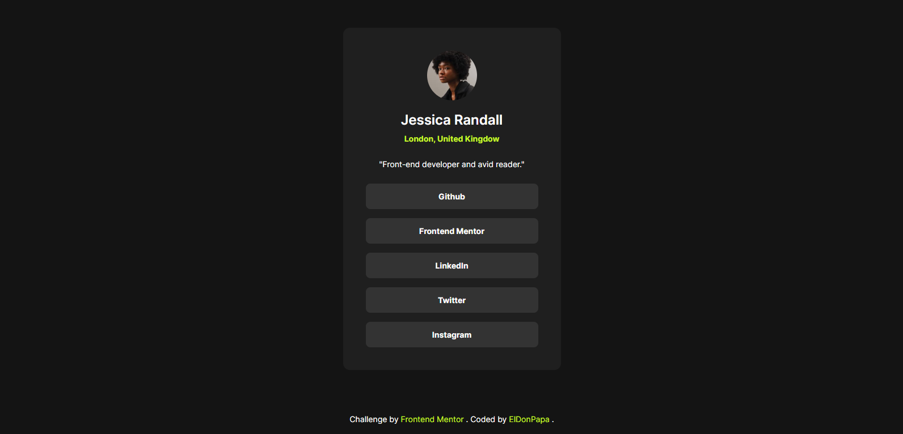

# Frontend Mentor - Social links profile solution

This is a solution to the [Social links profile challenge on Frontend Mentor](https://www.frontendmentor.io/challenges/social-links-profile-UG32l9m6dQ). Frontend Mentor challenges help you improve your coding skills by building realistic projects. 

## Table of contents

- [Overview](#overview)
  - [The challenge](#the-challenge)
  - [Screenshot](#screenshot)
  - [Links](#links)
- [My process](#my-process)
  - [Built with](#built-with)
  - [What I learned](#what-i-learned)
  - [Useful resources](#useful-resources)
- [Author](#author)

## Overview

### The challenge

Users should be able to:

- See hover and focus states for all interactive elements on the page

### Screenshot

### Links

- Solution URL: [frontendmentor.io/solutions/simple-solution-using-vitejs-bem-naming-convention-and-semantic-html-iyC5PluLSH](https://www.frontendmentor.io/solutions/simple-solution-using-vitejs-bem-naming-convention-and-semantic-html-iyC5PluLSH)
- Live Site URL: [fm-social-links-profile-beige.vercel.app/](https://fm-social-links-profile-beige.vercel.app/)

## My process

### Built with

- Semantic HTML5 markup
- Flexbox
- CSS custom properties
- Desktop-first workflow
- [BEM naming convention](https://en.bem.info/methodology/naming-convention/)
- [ViteJS](https://vite.dev/) - Build tool

### What I learned

It was my first time building anything responsive whatsoever. As little as it was needed for this project, it allowed me to learn about media queries to build responsive layouts.

### Useful resources

- [Kevin Powell Video about Media Queries](https://www.youtube.com/watch?v=2rlWBZ17Wes) - This superb video helped me get a clear understanding about how to use media queries, and the multiple values that they can take.
- [Web.dev article about Media Queries](https://web.dev/learn/design/media-queries) - This article helped me learn about media queries and its broader uses more in depth.

## Author

- Frontend Mentor - [@ElDonPapa](https://www.frontendmentor.io/profile/ElDonPapa)
